Grant Proposal | [60 - Financial crime prevention and risk intelligence on-chain tool](https://portal.devxdao.com/public-proposals/60)
------------ | -------------
Milestone | 2
Milestone Title | Web Interface
OP | Aberto
Reviewer | Kutay Karademir <eee.kutay@gmail.com>


# Milestone Details


## Details & Acceptance Criteria

**Details of what will be delivered in milestone:**

- Web Interface

**Acceptance criteria:**

- Have an interactive Web interface that leverages on the GraphQL API and enables the "trace the coin" solution.


**Additional notes regarding submission from OP:**

This second milestone builds on top of the first milestone and adds a front-end interface built on react.js.

## Milestone Submission

The following milestone assets/artifacts were submitted for review:

Repository | Revision Reviewed
------------ | -------------
https://github.com/syntifi/ori| ade4902

# Install & Usage Testing Procedure and Findings

Following the instructions in the README file of the repositoty : https://github.com/syntifi/ori and the file provided as a guide for this milestone
https://github.com/syntifi/ori/blob/main/TLDR-CSPR.md


First of all , Reviewer started to install the required dependencies.

```console
Java 11
Maven (3.8.1 or above)
Docker
Docker compose (version 1.29.2 or above)
Node.js (>=14.0.0)
```

Test and build the project:

```bash
kutaykarademir@MacBook-Pro ori-main % ./mvnw clean compile

```
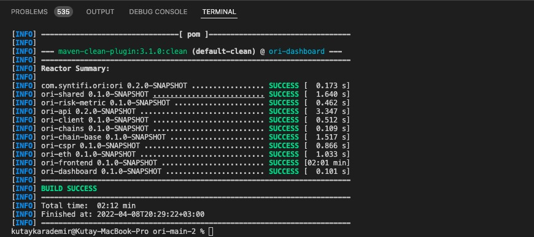

Build libs, jars and images:

```bash
kutaykarademir@MacBook-Pro ori-main % ./mvnw package -DskipTests
```
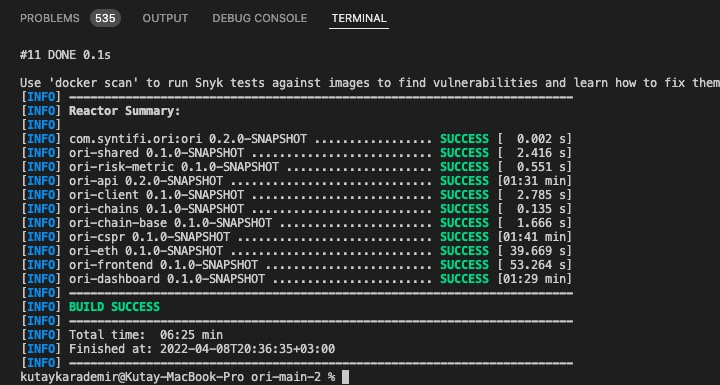

Create a docker network ori:

```bash
kutaykarademir@MacBook-Pro ori-main %  docker network create ori
```

Start postgresql and api modules (docker images):

```bash
kutaykarademir@MacBook-Pro ori-main % docker-compose -f ./ori-api/src/main/docker/docker-compose-jvm.yml up -d
```

the reviewer was able to verify that the 2 docker images were up :

```bash
kutaykarademir@MacBook-Pro ori-main % docker-compose -f ori-api/src/main/docker/docker-compose-jvm.yml ps
```
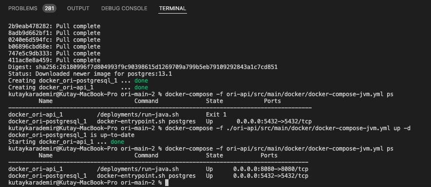

Launch the crawler for CSPR chain:

```bash
kutaykarademir@MacBook-Pro ori-main % docker-compose -f ./ori-chains/ori-cspr/src/main/docker/docker-compose.yml up -d
```

the reviewer was able to verify that the docker image was up :

 ```bash
kutaykarademir@MacBook-Pro ori-main %  docker-compose -f ori-chains/ori-cspr/src/main/docker/docker-compose.yml ps
 ```
 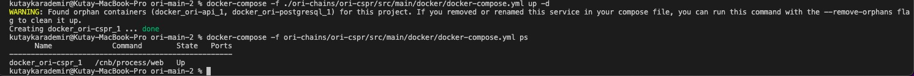
 
The reviewer was then able to check crawling is up and running using the following command line :

 ```bash
docker-compose -f ori-chains/ori-cspr/src/main/docker/docker-compose.yml logs -f
 ```
 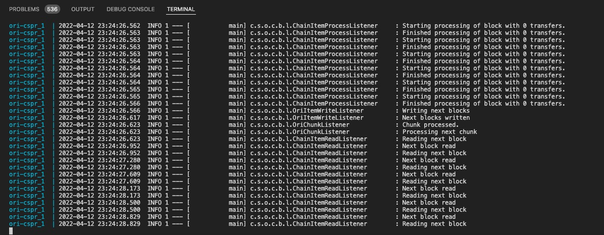

Check the database was populated:

The reviewer used  pgAdmin program to check the datas was successfully injected by the crawling process :
He verified 3 main tables :
   
   * Account :

   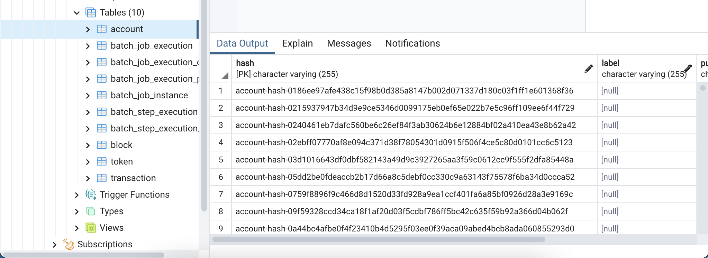 

   * Block:

   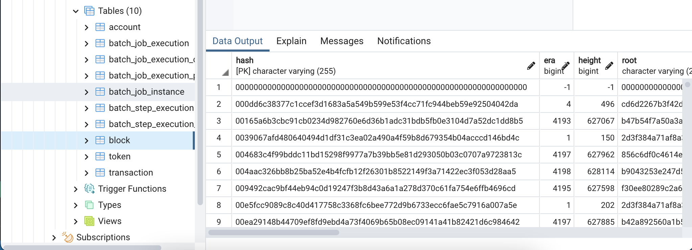
   
   * Transaction:

   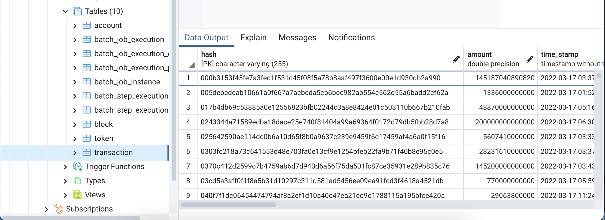
   
   * Token:
   
   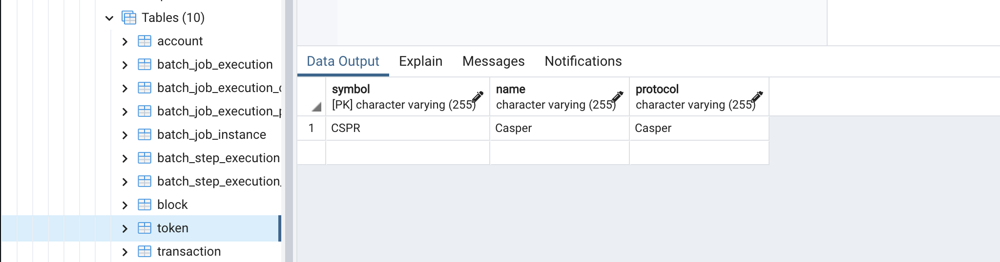

Access the front-end

The reviewer was able to check that the front end webapp is up and running.
He could then access it using the url : http://server_ip_address:8080
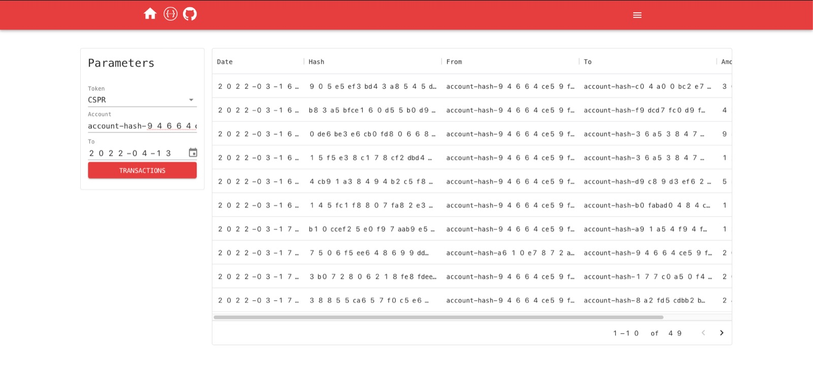

## Overall Impression of usage testing
The reviewer was able to build the project and the dashboard component following the instructions given in the README files on the repository.
**However, the OP is encouraged to add examples of data analysis performed when using the dashboard in the module main page. This will allow a quick understanding of the objective of the module.
It would also be desirable to mention the use of 'Apache Superset' platform in the project (with a link to the projet repository) and to add complete test scenarios in this module to allow any user to easily test the plateform**


Requirement | Finding
------------ | -------------
Project builds and runs without errors | PASS
Documentation provides sufficient installation/execution instructions | PASS with Notes
Project functionality meets/exceeds acceptance criteria and operates without error | PASS 


# Unit / Automated Testing
This part of the project uses Apache superSet to perform data analysis and exploration. 
There are currently no tools to perform automated tests on this platform. the reviewer was limited to running the above test scenarios.

Based on last review , the project contained only 24 unit tests accross all its modules . 
An effort has been made to improve the test coverage of the project which now has 107 unit tests.
The tests can be executed from the console and cover both positive and negative test paths.


```bash
kutaykarademir@MacBook-Pro ori-main % sudo ./mvnw test
```
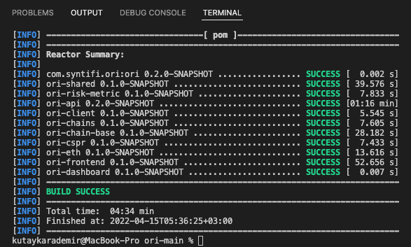
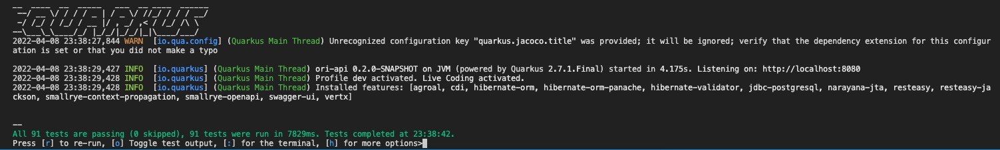

Requirement | Finding
------------ | -------------
Unit Tests - At least one positive path test | PASS
Unit Tests - At least one negative path test | PASS
Unit Tests - Additional path tests | PASS

# Documentation

### Code Documentation

A commendable effort has been made to document the project code following the remarks made on this point in the reviews of milestone 1. The code is now overall well documented  and almost all classes and critical functions have acceptable code-level documentation.


Requirement | Finding
------------ | -------------
Code documentation | PASS

### Project Documentation

The project documentation is generally sufficient and the instructions for building and running project are clear.
**However, it is desirable to add, within each module of the project, a detailled description of the component and its critical functions.
In order to give a quick undesrstaing of the whole project,  The OP is encouraged to add a brief description of what the project is about and its objectives. The reviewer had first to install and run the project and navigate through the different modules to get an idea of the purpose of the project.
The OP could add a diagram (simple package uml diagram) illustrating the links between the different modules.**

Requirement | Finding
------------ | -------------
Project Documentation | PASS with Notes


## Overall Conclusion on Documentation

In the reviewer's opinion, the project and usage documentation are sufficient. The OP is encouraged to provide detailed documentation  on the general usage of the project and its different modules.

# Open Source Practices

## Licenses

The Project is released under the MIT License

Requirement | Finding
------------ | -------------
OSI-approved open source software license | PASS

## Contribution Policies

The project contains a CONTRIBUTING policy that links to a Code of Conduct policy. Pull requests and Issues are enabled.

Requirement | Finding
------------ | -------------
OSS contribution best practices | PASS

# Coding Standards

## General Observations

Code is generally well-structured and readable. The project has been committed to GitHub and all 107 unit tests pass.

# Final Conclusion

The project provides the functionality described in the grant application and milestone acceptance criteria. 
**The reviewer spent a significant amount of time understanding the usefulness of the project and the its features.
The reviewer thus draws the OP's attention to the need to improve the general documentation of the project and its modules during the next milestones.**

In the reviewer's opinion, this submission should PASS with Notes

# Recommendation

Recommendation | PASS with Notes
------------ | -------------
